# 1. Getting in touch with Fusion360
Fusion360 is a 3D modeling software used by many professionals and hobbyists to create pieces. You can directly send your models to slicers in order to print them or export the 2D plans to build it your own. The following few chapters should give you a global overview of how Fusion360 works and what you can use it for. We'll try to orient our writing to learn your to design in order to print your models later and will end with some tips about the printing of your designs.

To complete your learning we strongly recommend you subscribe to <a href="https://www.youtube.com/channel/UCo29kn3d9ziFUZGZ50VKvWA">Lars Christensen's Youtube channel</a>. He's a master in the use of Fusion360 and has very well made videos about every problem of question you might have.

3 videos in particular should hold your attention to get started:
<a href="https://www.youtube.com/watch?v=A5bc9c3S12g"> Fusion 360 Tutorial for Absolute Beginners— Part 1</a> and of course <a href="https://www.youtube.com/watch?v=HXRMzJWo0-Q"> Fusion 360 Tutorial for Absolute Beginners— Part 2</a>  and <a href="https://www.youtube.com/watch?v=zS8dYA_Iluc&t=614s"> Fusion 360 Tutorial for Absolute Beginners— Part 3</a>.  

## Fusion360 environment
The first window you get when opening Fusion360 for the first time should be this.

 By clicking on  you access to the repository holding all your folders.
 A good practice is to sort them into other repositories according to their relevance.
 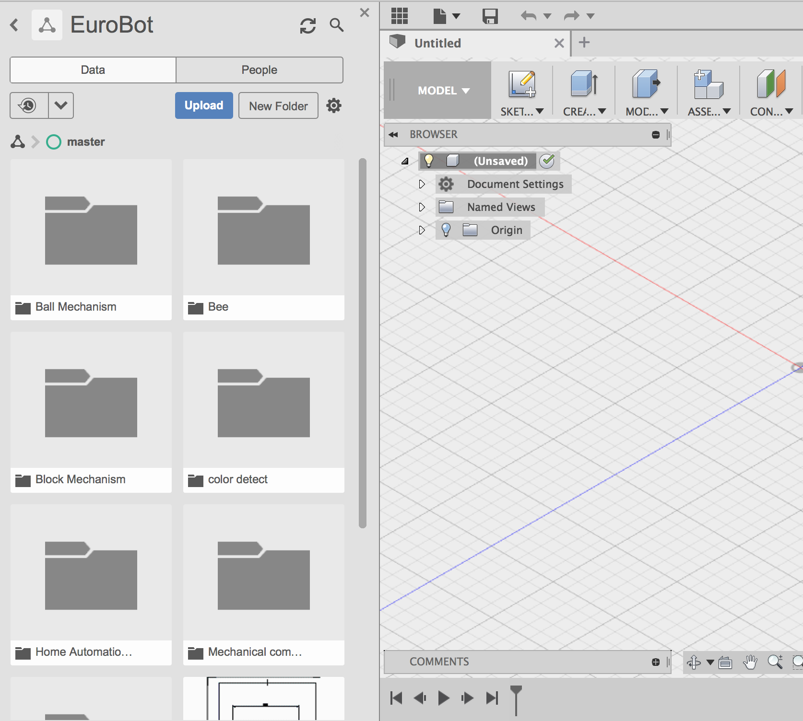

## Project view

We'll let you listen to M.Christensen by clicking on the links of the videos we gave earlier to learn the basics of Fusion360. He's an expert on the subject and honestly the only good way to learn the kind of software is by watching someone do and copy. Please don't learn the shortcuts by heart, you'll learn the most used ones by practicing.

# 2. Main Functions and Shotcuts
You should already be able to do your first model now but in case of you misted some of the multiple things explained by "Lars", we would like to give you a quick refresh.

To begin with, note that all function are easily available trough the "s" key shortcut. Just type some word related on what you are searching for and we are pretty sure that you'll find it fast. *Note that you can save them by clicking on the curved arrow.*

## 2.1. Shortcuts
You don't have to study them but with your first hour of practice you should already know them. If it's still not the case, you'll find them here:
- S=Model Toolbox

- L=Line
- C=Circle
- X=Construction
- D=Dimension

- Q=Push/Pull
- M=Move
- J=Joint
- T=Trim (delete some lines)

- center btn = Pan (move the view)
- Maj+ center btn  = 3D move

## 2.2. Useful functions

### Offset
Offset is a very handy tool when it comes to draw parallel lines.

The tools works only in sketch mode and you have to already have a reference line (or a shape). Type the "o"
key to open the "offset menu", you then have to select the reference line you want. You can either drag and drop the cursor with your mouse or type the value you wish the offset to be.
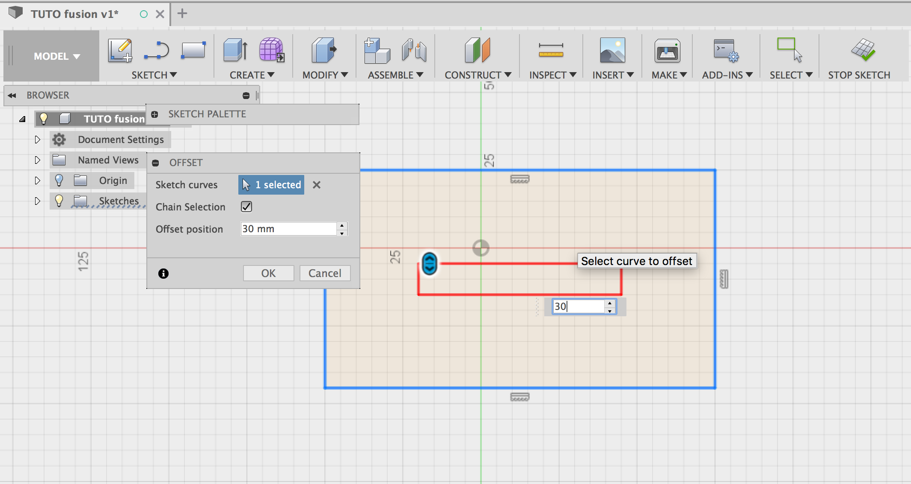
You'll end with the line/shape you selected offset as you wanted.

### Sweep

### Revolve
Revolve allows you to create object as if you turned them on a lathe. It comes in handy to make wheels, cannons, ...
To used it you have to first create a shape around an axis. When you create that shape, you have to imagine it round. So you only have to draw "a half cut in your future object".

Type "s" to access the "search menu" and enter "revolve" to see the tool. You'll have to select the shape and the axis you want and press "enter".
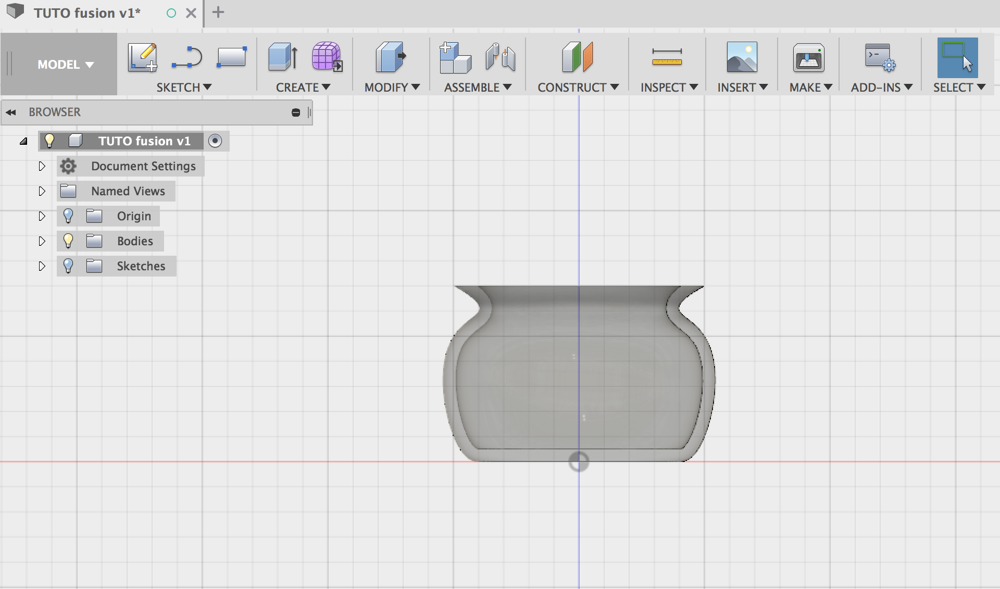

### Appearance
To make design easier for others to imagine or simply to choose colors and material purely esthetically, the "Appearance" tool is a must! You can archive more or less the same result with the "Physical Material" tool, but this is more often used for simulation. You can also combine those tools to get for example a steel pipe covered in leather without having to create the wrapping in a component.
It is also very handy when creating complex assemblies with little pieces because the different appearance help to see those different pieces.

Appearance is really easy to use. Type "a", choose the look you like and drag-drop it on the body you want. You can directly drop it in the project tree or on the visual objet.  

### Pattern
Real time savior, "Pattern" allows you to duplicate sketches, bodies and components on a given distance.
Multiple pattern tools exists. To see then go into the "search menu" and type "Pattern".

As you can see in the above picture, you can create a circular, rectangular or "free style" pattern.
For both rectangular and circular patterns the ones with white square create pattern in sketches. The grey ones create patterns of volumes (bodies, components). We'll only present the sketch pattern, but the volumes work in a similar way.
#### Rectangular pattern
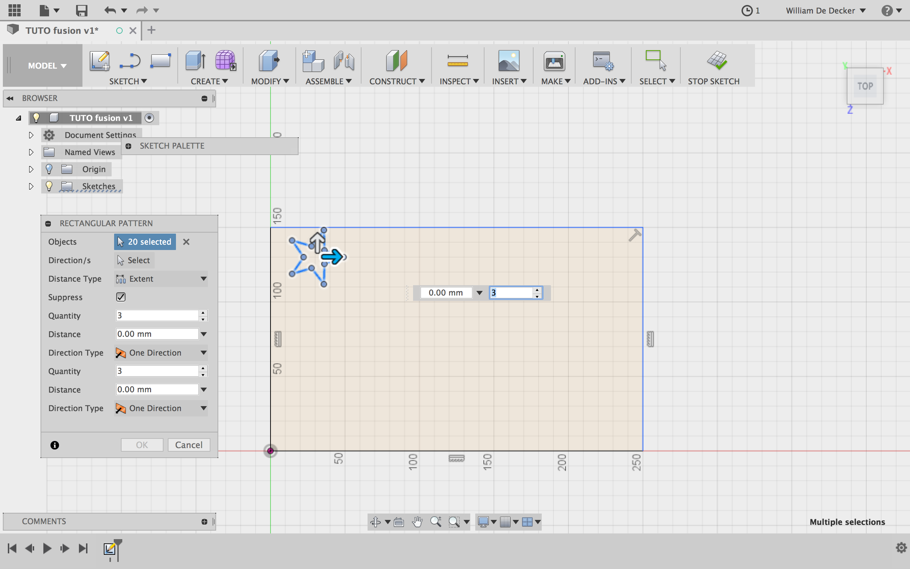
To apply rectangular patterns, select the desired shape and the amount of copies you want in the 2 directions. You can then enter (or drag-drop) the distance on which you want to copy that shape for both directions and click "ok".
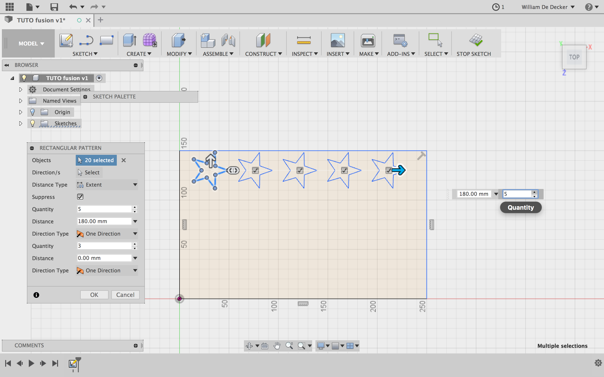
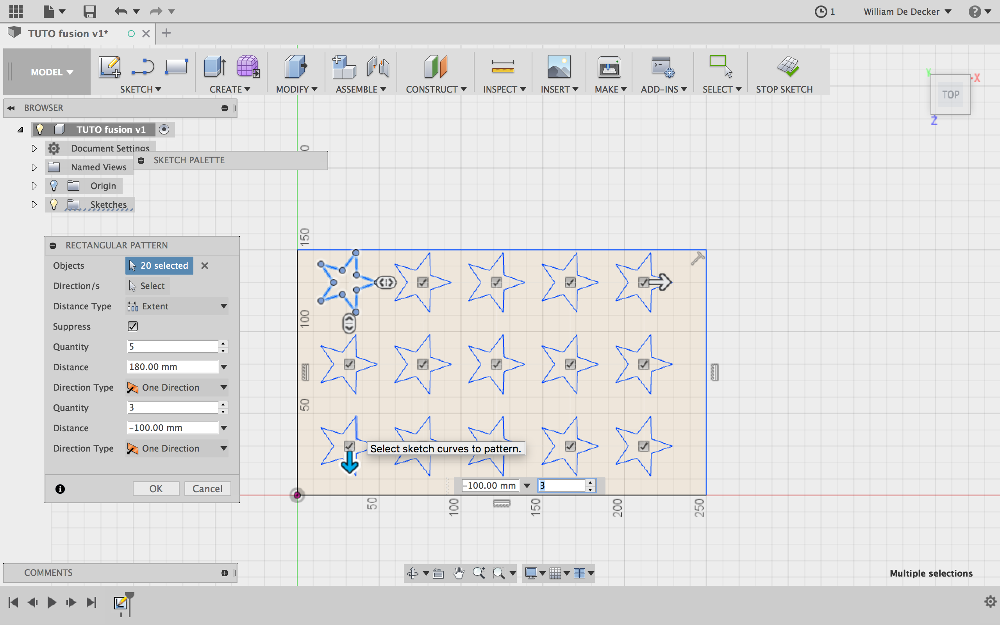
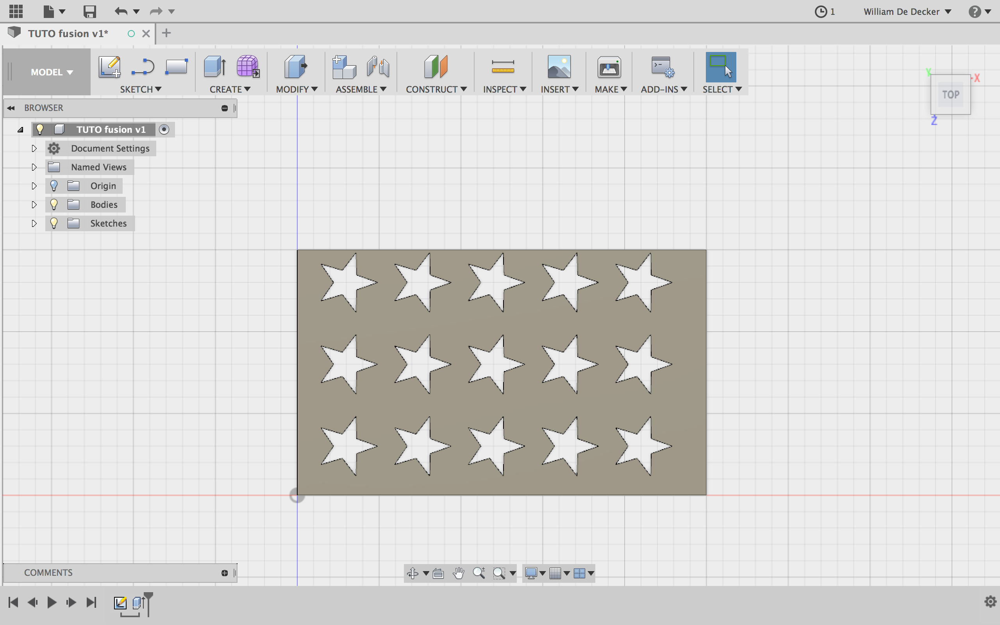
#### Circular pattern
Circular patterns work in a similar way accept the fact you have to choose a center point and you can choose to make a complete revolution around it you on a given angle.
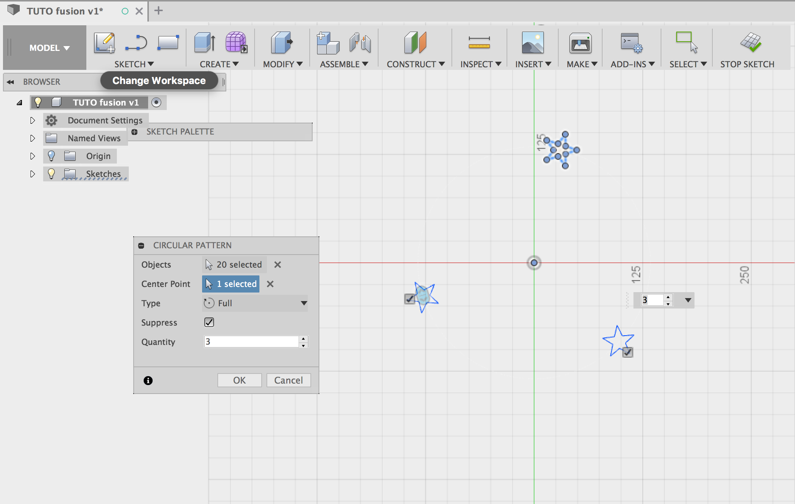
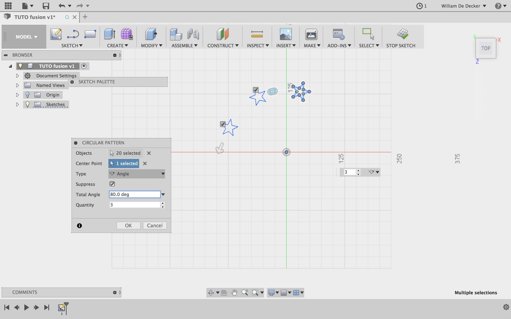

#### On path

The 'On path pattern' tools allows you to create patterns that are nor circular, nor rectangular.
It only works with volumes and you have to enable the display of the sketch your path is in.

### Mirror

### Fillet
As you used it in Autocad or similars, Fillet allow you to joint two lines to make one curve.
In Fusion 360, as a 3D software, you'll also find the possibility to "curve" your 3D model.

<figure>
  <figcaption>Fig. - First Fillet is for sketck and the second one for 3D model.</figcaption>
</figure>

To use the sketch fillet, just select it and then click on the two lines to join.

In the 3D model, just select the ridge and with the arrow or value chose the size of your fillet.

### Chamfer
In the same way of thinking than for the Fillet, you'll have the possibility to make some Chamfer.
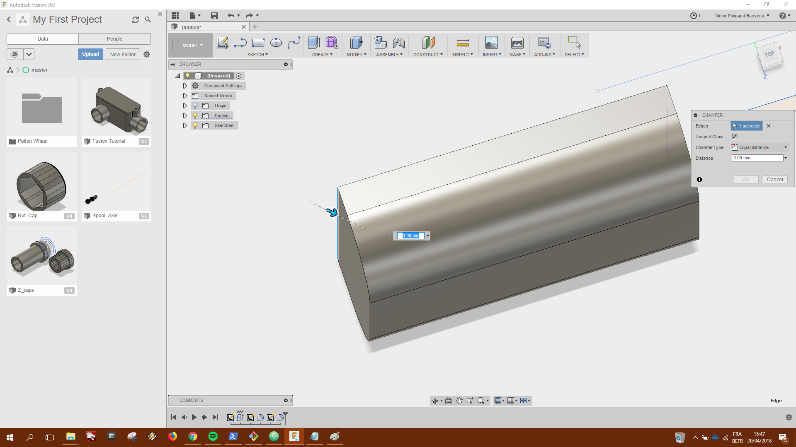
Select the tools and click on the ridge.
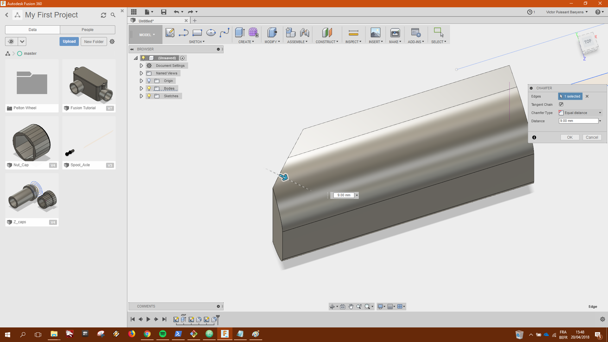
You'll also be able to do it with a curved ridge (the one made with fillet)
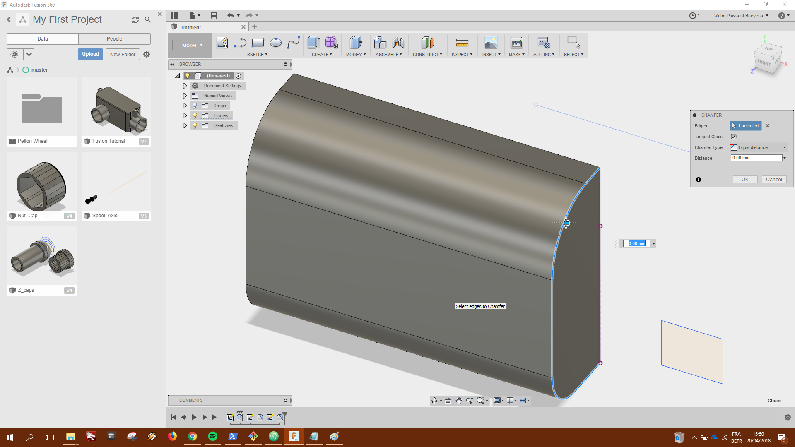
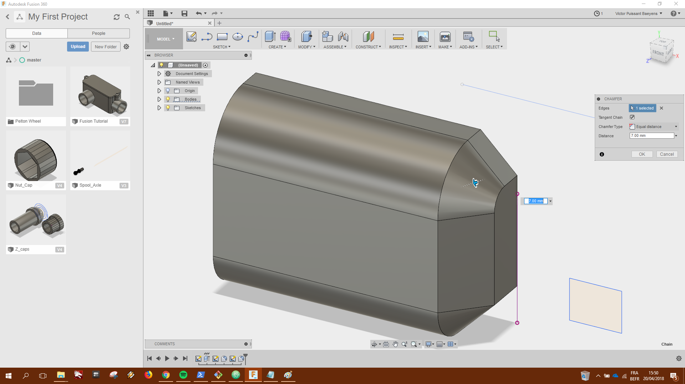
*Note that in this case you'll be limited by the angle of the previous made fillet.*

